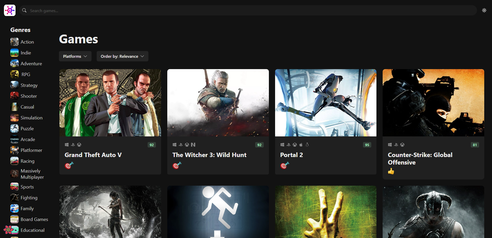

# GameHub

GameHub is a video game discovery web application that allows users to find new and interesting games. With GameHub, users can search for games by platform, genre, view game details, and more.

## Demo

<https://styled-gamehub.netlify.app>

## Get started locally

1. Clone this repository to your local machine.
2. Run `npm install` to install the required dependencies.
3. Get a RAWG API key at <https://rawg.io/apidocs>. You'll have to create an account first.
4. Duplicate the `.env.example` file and rename it to `.env.local` and add your API key in there.
5. Run `npm run dev` to start the local web server.

## Screenshots

